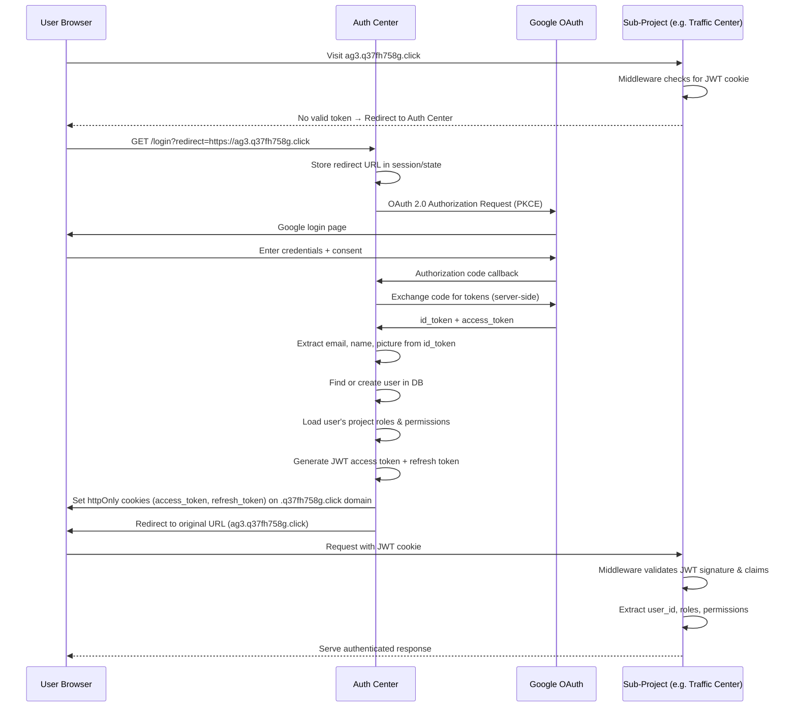
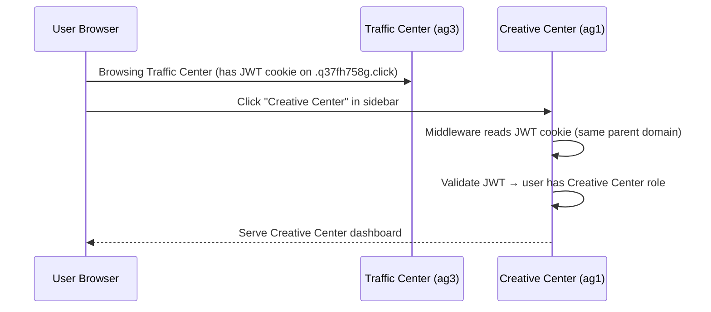
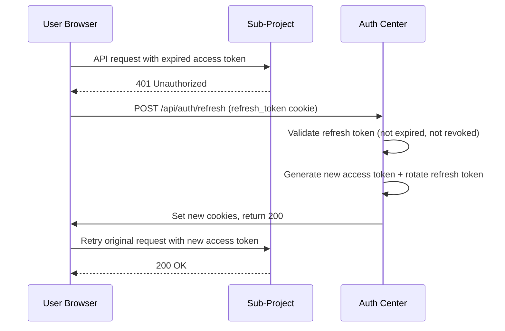
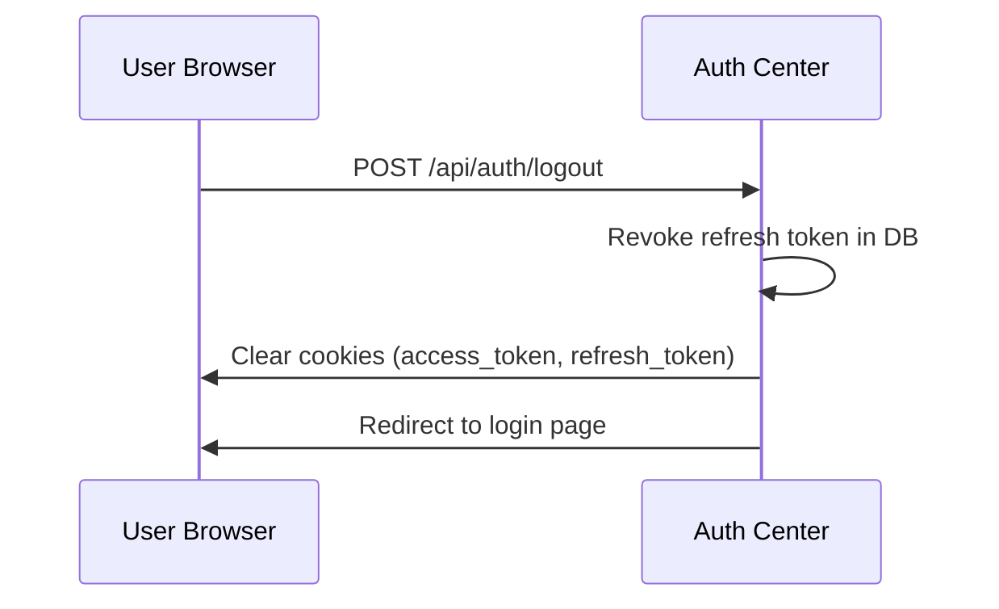

# Auth Center — Architecture Document

> Version: 1.0
> Date: 2026-02-20
> Status: Design Complete — Ready for Implementation

---

## Table of Contents

1. [Overview](#1-overview)
2. [Authentication Flow — Google SSO](#2-authentication-flow--google-sso)
3. [Token Strategy](#3-token-strategy)
4. [RBAC Model](#4-rbac-model)
5. [Database Schema](#5-database-schema)
6. [API Design](#6-api-design)
7. [Integration Strategy](#7-integration-strategy)
8. [Security](#8-security)
9. [Cross-Project Permission Catalog](#9-cross-project-permission-catalog)
10. [Deployment & Infrastructure](#10-deployment--infrastructure)

---

## 1. Overview

The Auth Center is a centralized authentication and authorization service for the Fully Automated Media Buying Platform. It serves three sub-projects:

| Project | Domain | Stack | Current Auth |
|---------|--------|-------|-------------|
| **Creative Center** | `ag1.q37fh758g.click` | FastAPI + Next.js | Nginx basic auth only |
| **Retention Center** | `ag2.q37fh758g.click` | Next.js (App Router) | None |
| **Traffic Center** | `ag3.q37fh758g.click` | Fastify + Next.js | None (users table removed) |

**None of the sub-projects have application-level authentication.** Auth Center will provide:

- Google SSO login (single entry point for all projects)
- JWT-based session management with refresh tokens
- Role-Based Access Control (RBAC) with per-project role assignments
- Granular permissions per resource type per project
- Shared auth SDK/middleware for each sub-project to validate tokens
- Centralized user management and audit logging

### Key Design Principles

1. **Single Sign-On**: One login, access all projects based on assigned roles
2. **Token-based**: Stateless JWT for API auth; refresh tokens for session continuity
3. **Project-scoped roles**: A user can be Admin on Creative Center but Viewer on Traffic Center
4. **Minimal sub-project changes**: Sub-projects only need to add JWT validation middleware — no user tables, no login pages
5. **Backwards-compatible**: Webhooks and M2M integration endpoints keep their existing auth mechanisms

---

## 2. Authentication Flow — Google SSO

### 2.1 Login Flow



### 2.2 Cross-Project Navigation (Already Logged In)



Since all sub-projects are on subdomains of `q37fh758g.click`, the JWT cookie set on `.q37fh758g.click` is automatically sent to all sub-projects. No token-passing or redirects needed for cross-project navigation.

### 2.3 Token Refresh Flow



### 2.4 Logout Flow



---

## 3. Token Strategy

### 3.1 Access Token (JWT)

| Property | Value |
|----------|-------|
| Format | JWT (RS256 — asymmetric) |
| Expiry | 15 minutes |
| Storage | httpOnly, Secure, SameSite=Lax cookie on `.q37fh758g.click` |
| Refresh | Via refresh token endpoint |

**Payload claims:**

```json
{
  "sub": "user_uuid",
  "email": "user@example.com",
  "name": "John Doe",
  "picture": "https://...",
  "roles": {
    "creative_center": "admin",
    "traffic_center": "media_buyer",
    "retention_center": "viewer"
  },
  "permissions": {
    "creative_center": ["agents:read", "agents:create", "creatives:generate", "..."],
    "traffic_center": ["campaigns:read", "campaigns:write", "budgets:adjust", "..."],
    "retention_center": ["leads:view", "reports:view"]
  },
  "iat": 1708000000,
  "exp": 1708000900,
  "iss": "auth-center",
  "aud": ["creative_center", "traffic_center", "retention_center"]
}
```

**Why RS256 (asymmetric)?**
- Auth Center holds the private key and signs tokens
- Sub-projects only need the public key (or JWKS endpoint) to verify
- No shared secrets to manage across 3+ services
- Key rotation without coordinating with sub-projects

### 3.2 Refresh Token

| Property | Value |
|----------|-------|
| Format | Opaque string (UUID v4), stored in DB |
| Expiry | 30 days |
| Storage | httpOnly, Secure, SameSite=Strict cookie, path=/api/auth |
| Rotation | New refresh token issued on every use; old one revoked |
| Family tracking | Reuse detection — if a revoked token is used, revoke entire family |

### 3.3 JWKS Endpoint

Auth Center exposes `GET /api/auth/.well-known/jwks.json` returning the current public key(s). Sub-projects fetch and cache this for JWT verification.

```json
{
  "keys": [
    {
      "kty": "RSA",
      "kid": "key-2026-02",
      "use": "sig",
      "alg": "RS256",
      "n": "...",
      "e": "AQAB"
    }
  ]
}
```

### 3.4 Service-to-Service Tokens

For machine-to-machine communication between sub-projects (e.g., Traffic Center calling Creative Center API):

| Property | Value |
|----------|-------|
| Format | Static API key (existing `X-Api-Key` mechanism) |
| Scope | Per-integration, configured in env vars |
| Auth header | `X-Api-Key: <key>` |

Existing M2M auth (Traffic Center's `INTEGRATION_API_KEY`, webhook secrets) remains unchanged. JWT is for user-facing requests only.

---

## 4. RBAC Model

### 4.1 Roles

Predefined roles with hierarchical permission inheritance:

| Role | Level | Description |
|------|-------|-------------|
| `super_admin` | 0 (highest) | Full access to Auth Center + all projects. Can manage users, roles, and global settings. |
| `project_admin` | 1 | Full access to assigned project(s). Can manage project settings, not Auth Center config. |
| `manager` | 2 | Can manage campaigns, content, and team workflows in assigned project(s). |
| `operator` | 3 | Day-to-day operational access — create/edit resources, send communications. |
| `viewer` | 4 (lowest) | Read-only access to assigned project(s). |

### 4.2 Per-Project Role Assignment

A user has a role **per project**. Examples:

| User | Creative Center | Traffic Center | Retention Center |
|------|----------------|---------------|-----------------|
| Alice | `project_admin` | `project_admin` | `project_admin` |
| Bob | `manager` | `viewer` | — (no access) |
| Carol | — | `operator` | `manager` |
| Dave | `viewer` | `viewer` | `viewer` |

A user with no role assigned for a project has **zero access** to that project.

### 4.3 Permission Structure

Permissions follow the pattern: `resource:action`

Each role has a predefined set of permissions. Permissions are stored in the `role_permissions` table and can be customized per deployment, but ship with sensible defaults.

### 4.4 Default Role-Permission Mapping

#### Creative Center

| Permission | viewer | operator | manager | project_admin |
|-----------|--------|----------|---------|---------------|
| `agents:read` | Y | Y | Y | Y |
| `agents:create` | | | Y | Y |
| `agents:update` | | | Y | Y |
| `agents:delete` | | | | Y |
| `agents:telegram` | | | Y | Y |
| `chat:send` | | Y | Y | Y |
| `chat:upload` | | Y | Y | Y |
| `creatives:read` | Y | Y | Y | Y |
| `creatives:generate` | | Y | Y | Y |
| `creatives:feedback` | | Y | Y | Y |
| `brands:read` | Y | Y | Y | Y |
| `brands:create` | | | Y | Y |
| `brands:update` | | | Y | Y |
| `brands:delete` | | | | Y |
| `memory:read` | Y | Y | Y | Y |
| `memory:write` | | Y | Y | Y |
| `memory:update` | | | Y | Y |
| `memory:delete` | | | | Y |
| `memory:promote` | | | Y | Y |
| `memory:consolidate` | | | | Y |
| `memory:admin` | | | | Y |
| `adaptor:read` | Y | Y | Y | Y |
| `adaptor:import` | | Y | Y | Y |
| `adaptor:gdrive` | | Y | Y | Y |
| `adaptor:analyze` | | | Y | Y |
| `adaptor:insights` | | | Y | Y |
| `adaptor:inject` | | | Y | Y |
| `adaptor:delete` | | | | Y |
| `adaptor:mappings` | | Y | Y | Y |
| `rules:read` | Y | Y | Y | Y |
| `rules:write` | | | Y | Y |
| `rules:delete` | | | | Y |
| `usage:read` | Y | Y | Y | Y |

#### Traffic Center

| Permission | viewer | operator | manager | project_admin |
|-----------|--------|----------|---------|---------------|
| `accounts:read` | Y | Y | Y | Y |
| `accounts:write` | | | | Y |
| `accounts:admin` | | | | Y |
| `campaigns:read` | Y | Y | Y | Y |
| `campaigns:write` | | Y | Y | Y |
| `campaigns:pause_resume` | | Y | Y | Y |
| `campaigns:delete` | | | Y | Y |
| `campaigns:duplicate` | | Y | Y | Y |
| `campaigns:bulk` | | | Y | Y |
| `budgets:read` | Y | Y | Y | Y |
| `budgets:adjust` | | Y | Y | Y |
| `budgets:override_safety` | | | | Y |
| `creatives:read` | Y | Y | Y | Y |
| `creatives:upload` | | Y | Y | Y |
| `creatives:request` | | Y | Y | Y |
| `audiences:read` | Y | Y | Y | Y |
| `audiences:write` | | Y | Y | Y |
| `audiences:delete` | | | Y | Y |
| `analytics:read` | Y | Y | Y | Y |
| `analytics:export` | | Y | Y | Y |
| `rules:read` | Y | Y | Y | Y |
| `rules:write` | | | Y | Y |
| `rules:toggle` | | Y | Y | Y |
| `rules:delete` | | | Y | Y |
| `rules:test` | | Y | Y | Y |
| `ai:read` | Y | Y | Y | Y |
| `ai:approve_reject` | | Y | Y | Y |
| `ai:memory_write` | | | Y | Y |
| `ai:config` | | | | Y |
| `settings:read` | Y | Y | Y | Y |
| `settings:write` | | | Y | Y |
| `notifications:manage` | | Y | Y | Y |
| `api_keys:manage` | | | | Y |
| `webhooks:manage` | | | | Y |
| `lead_forms:read` | Y | Y | Y | Y |
| `lead_forms:write` | | | Y | Y |

#### Retention Center

| Permission | viewer | operator | manager | project_admin |
|-----------|--------|----------|---------|---------------|
| `leads:view` | Y | Y | Y | Y |
| `leads:create` | | Y | Y | Y |
| `leads:edit` | | Y | Y | Y |
| `leads:delete` | | | Y | Y |
| `leads:bulk_import` | | | Y | Y |
| `campaigns:view` | Y | Y | Y | Y |
| `campaigns:create` | | | Y | Y |
| `campaigns:edit` | | Y | Y | Y |
| `campaigns:delete` | | | Y | Y |
| `sequences:view` | Y | Y | Y | Y |
| `sequences:create` | | | Y | Y |
| `sequences:edit` | | Y | Y | Y |
| `sequences:delete` | | | Y | Y |
| `scripts:view` | Y | Y | Y | Y |
| `scripts:create` | | Y | Y | Y |
| `scripts:edit` | | Y | Y | Y |
| `scripts:delete` | | | Y | Y |
| `integrations:view` | Y | Y | Y | Y |
| `integrations:manage` | | | | Y |
| `send:email` | | Y | Y | Y |
| `send:sms` | | Y | Y | Y |
| `send:call` | | Y | Y | Y |
| `send:test` | | Y | Y | Y |
| `reports:view` | Y | Y | Y | Y |
| `learning:view` | Y | Y | Y | Y |
| `learning:manage` | | | Y | Y |
| `conversions:view` | Y | Y | Y | Y |
| `scheduler:execute` | | | | Y |

### 4.5 Super Admin

The `super_admin` role is global (not project-scoped). A super admin:
- Has all permissions on all projects
- Can access Auth Center admin panel (user management, role management, audit log)
- Can assign/revoke roles for any user on any project
- Token claims include `"super_admin": true` flag

---

## 5. Database Schema

### 5.1 Entity Relationship

```
users 1──* user_project_roles *──1 projects
                  │
                  └──1 roles 1──* role_permissions *──1 permissions

users 1──* refresh_tokens
users 1──* audit_log
users 1──* sessions
```

### 5.2 Table Definitions

#### `users`

| Column | Type | Constraints | Description |
|--------|------|------------|-------------|
| `id` | UUID | PK, default gen_random_uuid() | Unique user ID |
| `email` | VARCHAR(255) | UNIQUE, NOT NULL | Google account email |
| `name` | VARCHAR(255) | NOT NULL | Display name from Google |
| `picture` | TEXT | | Avatar URL from Google |
| `google_id` | VARCHAR(255) | UNIQUE, NOT NULL | Google subject ID (stable) |
| `is_super_admin` | BOOLEAN | NOT NULL, DEFAULT false | Global super admin flag |
| `is_active` | BOOLEAN | NOT NULL, DEFAULT true | Account enabled/disabled |
| `last_login_at` | TIMESTAMP | | Last successful login |
| `created_at` | TIMESTAMP | NOT NULL, DEFAULT now() | |
| `updated_at` | TIMESTAMP | NOT NULL, DEFAULT now() | |

#### `projects`

| Column | Type | Constraints | Description |
|--------|------|------------|-------------|
| `id` | VARCHAR(50) | PK | Slug: `creative_center`, `traffic_center`, `retention_center` |
| `name` | VARCHAR(255) | NOT NULL | Display name |
| `domain` | VARCHAR(255) | NOT NULL | Production domain (e.g. `ag1.q37fh758g.click`) |
| `description` | TEXT | | |
| `created_at` | TIMESTAMP | NOT NULL, DEFAULT now() | |

Seeded with three rows at init.

#### `roles`

| Column | Type | Constraints | Description |
|--------|------|------------|-------------|
| `id` | VARCHAR(50) | PK | Slug: `viewer`, `operator`, `manager`, `project_admin` |
| `name` | VARCHAR(255) | NOT NULL | Display name |
| `level` | INTEGER | NOT NULL | Hierarchy level (0=highest) |
| `description` | TEXT | | |
| `created_at` | TIMESTAMP | NOT NULL, DEFAULT now() | |

Seeded with four rows at init.

#### `permissions`

| Column | Type | Constraints | Description |
|--------|------|------------|-------------|
| `id` | VARCHAR(100) | PK | Format: `resource:action` |
| `project_id` | VARCHAR(50) | FK → projects.id, NOT NULL | Which project this permission belongs to |
| `resource` | VARCHAR(50) | NOT NULL | Resource group (e.g. `agents`, `campaigns`) |
| `action` | VARCHAR(50) | NOT NULL | Action (e.g. `read`, `create`, `delete`) |
| `description` | TEXT | | Human-readable description |
| `created_at` | TIMESTAMP | NOT NULL, DEFAULT now() | |

Composite unique: `(project_id, resource, action)`

#### `role_permissions`

| Column | Type | Constraints | Description |
|--------|------|------------|-------------|
| `role_id` | VARCHAR(50) | FK → roles.id, NOT NULL | |
| `permission_id` | VARCHAR(100) | FK → permissions.id, NOT NULL | |
| `project_id` | VARCHAR(50) | FK → projects.id, NOT NULL | Project context for this mapping |

PK: `(role_id, permission_id, project_id)`

#### `user_project_roles`

| Column | Type | Constraints | Description |
|--------|------|------------|-------------|
| `id` | UUID | PK, default gen_random_uuid() | |
| `user_id` | UUID | FK → users.id, NOT NULL | |
| `project_id` | VARCHAR(50) | FK → projects.id, NOT NULL | |
| `role_id` | VARCHAR(50) | FK → roles.id, NOT NULL | |
| `assigned_by` | UUID | FK → users.id | Who assigned this role |
| `created_at` | TIMESTAMP | NOT NULL, DEFAULT now() | |
| `updated_at` | TIMESTAMP | NOT NULL, DEFAULT now() | |

Unique: `(user_id, project_id)` — one role per user per project.

#### `refresh_tokens`

| Column | Type | Constraints | Description |
|--------|------|------------|-------------|
| `id` | UUID | PK, default gen_random_uuid() | |
| `user_id` | UUID | FK → users.id, NOT NULL | |
| `token_hash` | VARCHAR(255) | UNIQUE, NOT NULL | SHA-256 hash of the token |
| `family_id` | UUID | NOT NULL | Token rotation family (for reuse detection) |
| `expires_at` | TIMESTAMP | NOT NULL | |
| `revoked_at` | TIMESTAMP | | NULL if active |
| `created_at` | TIMESTAMP | NOT NULL, DEFAULT now() | |
| `user_agent` | TEXT | | Browser/device info |
| `ip_address` | VARCHAR(45) | | Client IP |

Index on `token_hash`, `family_id`, `user_id`.

#### `sessions`

| Column | Type | Constraints | Description |
|--------|------|------------|-------------|
| `id` | UUID | PK, default gen_random_uuid() | |
| `user_id` | UUID | FK → users.id, NOT NULL | |
| `refresh_token_family` | UUID | NOT NULL | Links to refresh_tokens.family_id |
| `user_agent` | TEXT | | |
| `ip_address` | VARCHAR(45) | | |
| `last_active_at` | TIMESTAMP | NOT NULL, DEFAULT now() | |
| `created_at` | TIMESTAMP | NOT NULL, DEFAULT now() | |
| `revoked_at` | TIMESTAMP | | NULL if active |

#### `audit_log`

| Column | Type | Constraints | Description |
|--------|------|------------|-------------|
| `id` | UUID | PK, default gen_random_uuid() | |
| `user_id` | UUID | FK → users.id | NULL for system events |
| `action` | VARCHAR(100) | NOT NULL | e.g. `user.login`, `role.assign`, `user.deactivate` |
| `target_type` | VARCHAR(50) | | e.g. `user`, `role`, `project` |
| `target_id` | VARCHAR(255) | | ID of affected entity |
| `details` | JSON | | Additional context |
| `ip_address` | VARCHAR(45) | | |
| `user_agent` | TEXT | | |
| `created_at` | TIMESTAMP | NOT NULL, DEFAULT now() | |

Index on `user_id`, `action`, `created_at`.

### 5.3 Prisma Schema (Summary)

The Auth Center uses Prisma 7 + SQLite (consistent with Retention Center). The full Prisma schema implements all tables above. Key relations:

```prisma
model User {
  id             String   @id @default(uuid())
  email          String   @unique
  googleId       String   @unique @map("google_id")
  name           String
  picture        String?
  isSuperAdmin   Boolean  @default(false) @map("is_super_admin")
  isActive       Boolean  @default(true) @map("is_active")
  lastLoginAt    DateTime? @map("last_login_at")

  projectRoles   UserProjectRole[]
  refreshTokens  RefreshToken[]
  sessions       Session[]
  auditLogs      AuditLog[]       @relation("actor")

  createdAt      DateTime @default(now()) @map("created_at")
  updatedAt      DateTime @updatedAt @map("updated_at")

  @@map("users")
}

model UserProjectRole {
  id         String   @id @default(uuid())
  userId     String   @map("user_id")
  projectId  String   @map("project_id")
  roleId     String   @map("role_id")
  assignedBy String?  @map("assigned_by")

  user       User     @relation(fields: [userId], references: [id])
  project    Project  @relation(fields: [projectId], references: [id])
  role       Role     @relation(fields: [roleId], references: [id])

  createdAt  DateTime @default(now()) @map("created_at")
  updatedAt  DateTime @updatedAt @map("updated_at")

  @@unique([userId, projectId])
  @@map("user_project_roles")
}
```

---

## 6. API Design

### 6.1 Auth Endpoints (Public)

#### `GET /login`
Renders the login page. If `?redirect=<url>` is provided, stores it for post-login redirect.

#### `GET /api/auth/google`
Initiates Google OAuth 2.0 flow with PKCE.

**Query params:**
- `redirect` (optional) — URL to return to after login

**Response:** 302 redirect to Google consent screen.

#### `GET /api/auth/google/callback`
Google OAuth callback handler.

**Query params:**
- `code` — Authorization code from Google
- `state` — CSRF state parameter

**Response:** Sets cookies, 302 redirect to original URL or dashboard.

#### `POST /api/auth/refresh`
Refresh access token using refresh token cookie.

**Request:** Refresh token sent automatically via httpOnly cookie.

**Response:**
```json
{
  "success": true,
  "user": {
    "id": "uuid",
    "email": "user@example.com",
    "name": "John Doe",
    "picture": "https://..."
  }
}
```
Sets new access_token and refresh_token cookies.

#### `POST /api/auth/logout`
Revokes refresh token and clears cookies.

**Response:** 200 OK, cookies cleared.

#### `GET /api/auth/.well-known/jwks.json`
Returns public keys for JWT verification.

**Response:**
```json
{
  "keys": [{ "kty": "RSA", "kid": "...", "use": "sig", "alg": "RS256", "n": "...", "e": "AQAB" }]
}
```

#### `GET /api/auth/me`
Returns current user info from JWT.

**Headers:** `Authorization: Bearer <token>` or cookie.

**Response:**
```json
{
  "id": "uuid",
  "email": "user@example.com",
  "name": "John Doe",
  "picture": "https://...",
  "isSuperAdmin": false,
  "roles": {
    "creative_center": { "role": "manager", "permissions": ["agents:read", "..."] },
    "traffic_center": { "role": "viewer", "permissions": ["campaigns:read", "..."] }
  }
}
```

### 6.2 User Management Endpoints (Authenticated)

#### `GET /api/users`
List all users. Requires `super_admin` or `project_admin` on at least one project.

**Query params:** `page`, `limit`, `search` (email/name), `project` (filter by project access)

**Response:**
```json
{
  "users": [
    {
      "id": "uuid",
      "email": "user@example.com",
      "name": "John Doe",
      "picture": "https://...",
      "isActive": true,
      "lastLoginAt": "2026-02-20T10:00:00Z",
      "roles": {
        "creative_center": "manager",
        "traffic_center": "viewer"
      }
    }
  ],
  "total": 42,
  "page": 1,
  "limit": 20
}
```

#### `GET /api/users/:id`
Get user details. Requires `super_admin` or `project_admin`.

#### `PATCH /api/users/:id`
Update user (deactivate, change name override). Requires `super_admin`.

**Body:**
```json
{
  "isActive": false
}
```

#### `DELETE /api/users/:id`
Deactivate user and revoke all sessions. Requires `super_admin`.

### 6.3 Role Assignment Endpoints (Authenticated)

#### `POST /api/users/:userId/roles`
Assign a role to a user for a project. Requires `super_admin` or `project_admin` on that project.

**Body:**
```json
{
  "projectId": "traffic_center",
  "roleId": "operator"
}
```

**Response:** 201 Created with the new assignment.

#### `PUT /api/users/:userId/roles/:projectId`
Update a user's role for a project.

**Body:**
```json
{
  "roleId": "manager"
}
```

#### `DELETE /api/users/:userId/roles/:projectId`
Remove a user's access to a project.

### 6.4 Role & Permission Endpoints (Authenticated, super_admin only)

#### `GET /api/roles`
List all roles with their permission counts.

#### `GET /api/roles/:id`
Get role details with full permission list.

#### `GET /api/roles/:id/permissions?project=creative_center`
Get permissions for a role on a specific project.

#### `GET /api/permissions?project=creative_center`
List all permissions for a project.

### 6.5 Session Management Endpoints

#### `GET /api/sessions`
List current user's active sessions. Requires authentication.

**Response:**
```json
{
  "sessions": [
    {
      "id": "uuid",
      "userAgent": "Chrome/...",
      "ipAddress": "1.2.3.4",
      "lastActiveAt": "2026-02-20T10:00:00Z",
      "current": true
    }
  ]
}
```

#### `DELETE /api/sessions/:id`
Revoke a specific session (logout that device).

#### `DELETE /api/sessions`
Revoke all sessions except current (logout everywhere else).

### 6.6 Audit Log Endpoints (super_admin only)

#### `GET /api/audit-log`
Query audit log entries.

**Query params:** `page`, `limit`, `userId`, `action`, `from`, `to`

**Response:**
```json
{
  "entries": [
    {
      "id": "uuid",
      "userId": "uuid",
      "userName": "John Doe",
      "action": "role.assign",
      "targetType": "user",
      "targetId": "uuid",
      "details": { "project": "traffic_center", "role": "manager" },
      "ipAddress": "1.2.3.4",
      "createdAt": "2026-02-20T10:00:00Z"
    }
  ],
  "total": 150,
  "page": 1,
  "limit": 50
}
```

### 6.7 Invitation Endpoints

#### `POST /api/invitations`
Invite a user by email. If they have a Google account matching that email, they'll be auto-assigned the role on first login. Requires `super_admin` or `project_admin`.

**Body:**
```json
{
  "email": "newuser@example.com",
  "assignments": [
    { "projectId": "creative_center", "roleId": "operator" },
    { "projectId": "retention_center", "roleId": "viewer" }
  ]
}
```

#### `GET /api/invitations`
List pending invitations.

#### `DELETE /api/invitations/:id`
Cancel an invitation.

---

## 7. Integration Strategy

### 7.1 Auth SDK Package

Auth Center provides a shared SDK package at `/Users/sky/auth-center/sdk/` that each sub-project installs. The SDK provides:

1. **JWT verification** — Fetches JWKS from Auth Center, caches keys, verifies tokens
2. **Permission checking** — Helper functions to check user permissions
3. **Middleware factories** — Framework-specific middleware (FastAPI, Fastify, Next.js)

#### SDK API

```typescript
// @auth-center/sdk

// Core
function verifyToken(token: string, options?: VerifyOptions): Promise<TokenPayload>
function hasPermission(user: TokenPayload, project: string, permission: string): boolean
function hasAnyPermission(user: TokenPayload, project: string, permissions: string[]): boolean
function hasRole(user: TokenPayload, project: string, role: string): boolean

// Next.js middleware (for Retention Center, Auth Center dashboard)
function createAuthMiddleware(config: {
  authCenterUrl: string
  projectId: string
  publicPaths?: string[]      // paths that skip auth (e.g. /api/webhooks/*)
  loginUrl?: string           // defaults to authCenterUrl + /login
}): NextMiddleware

// Fastify plugin (for Traffic Center)
function fastifyAuthPlugin(fastify: FastifyInstance, options: {
  authCenterUrl: string
  projectId: string
  skipPaths?: string[]        // paths that skip JWT (webhooks, health)
}): void

// FastAPI dependency (for Creative Center) — Python equivalent
// Distributed as a Python package or single-file module
```

#### Python SDK (for Creative Center)

```python
# auth_center_sdk.py — drop into Creative Center's backend/

from fastapi import Depends, HTTPException, Request
from functools import lru_cache
import httpx, jwt

class AuthCenterSDK:
    def __init__(self, jwks_url: str, project_id: str):
        self.jwks_url = jwks_url
        self.project_id = project_id
        self._jwks_cache = None

    async def get_jwks(self):
        """Fetch and cache JWKS from Auth Center"""
        ...

    async def verify_token(self, token: str) -> dict:
        """Verify JWT and return payload"""
        ...

    def require_auth(self):
        """FastAPI dependency — validates JWT, returns user"""
        async def _dependency(request: Request):
            token = self._extract_token(request)
            if not token:
                raise HTTPException(401, "Missing authentication token")
            return await self.verify_token(token)
        return Depends(_dependency)

    def require_permission(self, permission: str):
        """FastAPI dependency — validates JWT + checks permission"""
        async def _dependency(request: Request):
            user = await self.require_auth()(request)
            perms = user.get("permissions", {}).get(self.project_id, [])
            if permission not in perms and not user.get("super_admin"):
                raise HTTPException(403, f"Missing permission: {permission}")
            return user
        return Depends(_dependency)
```

### 7.2 Integration per Sub-Project

#### Creative Center (FastAPI + Next.js)

| Component | Change |
|-----------|--------|
| `backend/config.py` | Add `AUTH_CENTER_URL` and `AUTH_PROJECT_ID=creative_center` env vars |
| `backend/middleware/auth.py` | New file — instantiate AuthCenterSDK, export `require_auth` and `require_permission` |
| `backend/api/*.py` | Add `Depends(require_permission("..."))` to each endpoint |
| `backend/api/agents.py` (WebSocket) | Validate JWT from `?token=` query param before `websocket.accept()` |
| `frontend/src/lib/api.ts` | Read JWT from cookie, add `Authorization: Bearer` header (or rely on cookie passthrough) |
| `frontend/src/middleware.ts` | New file — redirect to Auth Center login if no valid cookie |
| Nginx config | Remove basic auth, add redirect rule for unauthenticated HTML requests |

**Endpoints to SKIP auth:** `/health`, `/assets/*` (or use signed URLs), Telegram webhook

#### Traffic Center (Fastify + Next.js)

| Component | Change |
|-----------|--------|
| `apps/api/src/server.ts` | Register `fastifyAuthPlugin` from SDK |
| Route handlers | Replace `optionalApiKeyScope()` with `requirePermission()` from plugin |
| `apps/api/src/websocket/server.ts` | Validate JWT on WebSocket upgrade |
| `apps/dashboard/src/middleware.ts` | New file — use `createAuthMiddleware` from SDK |
| `apps/dashboard/src/lib/api-client.ts` | Attach JWT from cookie to requests |

**Endpoints to SKIP auth:** `/health`, `/api/v1/postback`, `/api/v1/webhooks/meta`, `/api/v1/system/status`, `/api/v1/integrations/*` (keep X-Api-Key)

#### Retention Center (Next.js App Router)

| Component | Change |
|-----------|--------|
| `src/middleware.ts` | New file — use `createAuthMiddleware` from SDK |
| `src/app/(dashboard)/layout.tsx` | Read user from JWT cookie, pass to context |
| `src/components/layout/header.tsx` | Replace static "RC" avatar with user data |
| `src/components/layout/sidebar.tsx` | Conditionally show nav items based on permissions |
| API routes | Add permission check at top of each handler (or middleware-level) |

**Endpoints to SKIP auth:** `/api/webhooks/*` (keep existing webhook secrets), `/api/scheduler/*` (add service token)

### 7.3 WebSocket Auth Strategy

All three projects use WebSockets. The approach:

1. Client connects with JWT as query parameter: `wss://host/ws?token=<jwt>`
2. Server validates JWT before accepting the upgrade
3. If invalid/expired, server sends close frame with code 4001 (Unauthorized)
4. Client-side: on 4001 close, refresh token and reconnect

### 7.4 Cookie Strategy for Cross-Domain SSO

Since all projects are subdomains of `q37fh758g.click`:

| Cookie | Domain | Path | Flags |
|--------|--------|------|-------|
| `ac_access` | `.q37fh758g.click` | `/` | httpOnly, Secure, SameSite=Lax |
| `ac_refresh` | `.q37fh758g.click` | `/api/auth` | httpOnly, Secure, SameSite=Strict |

- `SameSite=Lax` on access token allows it to be sent on top-level navigations between sub-projects
- `SameSite=Strict` on refresh token restricts it to Auth Center only (only needed for refresh calls)
- `Secure` flag requires HTTPS (all projects use SSL)

---

## 8. Security

### 8.1 CSRF Protection

- **Access token cookie**: `SameSite=Lax` prevents CSRF on POST/PUT/DELETE from cross-origin
- **Refresh token cookie**: `SameSite=Strict` prevents any cross-origin use
- **Additional protection**: For state-changing requests, sub-projects can verify the `Origin` header matches their domain
- **OAuth state parameter**: CSRF token in Google OAuth flow (stored in httpOnly cookie, verified on callback)

### 8.2 Token Security

| Measure | Implementation |
|---------|---------------|
| Short access token lifetime | 15 minutes — limits window of compromise |
| Refresh token rotation | New token on every refresh; old one revoked |
| Reuse detection | If a revoked refresh token is used, revoke entire token family |
| Token binding | Refresh tokens track IP + User-Agent; flag if they change |
| Secure storage | httpOnly cookies — not accessible via JavaScript |
| Asymmetric signing | RS256 — sub-projects never see the private key |
| Key rotation | JWKS with `kid` — rotate keys without breaking existing tokens |

### 8.3 Session Management

- **Concurrent session limit**: Default 5 per user (configurable)
- **Session listing**: Users can see all active sessions (device, IP, last active)
- **Remote logout**: Users can revoke any session; admins can revoke any user's sessions
- **Idle timeout**: Refresh tokens expire after 30 days of no use
- **Account deactivation**: Immediately revokes all sessions and refresh tokens

### 8.4 Rate Limiting

| Endpoint | Limit | Window |
|----------|-------|--------|
| `POST /api/auth/google` | 10 | per minute per IP |
| `POST /api/auth/refresh` | 30 | per minute per IP |
| `GET /api/auth/me` | 60 | per minute per user |
| `POST /api/users/*/roles` | 20 | per minute per user |
| `POST /api/invitations` | 10 | per minute per user |

Implemented via in-memory rate limiter (e.g., `rate-limiter-flexible` with Redis backing for production).

### 8.5 Input Validation

- All request bodies validated with Zod schemas
- Email addresses validated against RFC 5322
- UUIDs validated against v4 format
- Role and permission IDs validated against allowed values (enum)
- Redirect URLs validated against allowlist of project domains

### 8.6 Audit Logging

All security-sensitive actions are logged to `audit_log`:

| Action | Trigger |
|--------|---------|
| `user.login` | Successful Google SSO |
| `user.login_failed` | Login attempt for deactivated user |
| `user.logout` | Manual logout |
| `user.deactivate` | Admin deactivates a user |
| `user.reactivate` | Admin reactivates a user |
| `role.assign` | Role assigned to user |
| `role.update` | Role changed for user |
| `role.revoke` | Role removed from user |
| `session.revoke` | Session manually revoked |
| `session.revoke_all` | All sessions revoked |
| `token.refresh` | Token refreshed (logged with IP change detection) |
| `token.reuse_detected` | Revoked refresh token reused (potential compromise) |
| `invitation.create` | User invited |
| `invitation.cancel` | Invitation cancelled |

### 8.7 Allowed Redirect Domains

After login, the redirect URL is validated against:

```
ag1.q37fh758g.click  (Creative Center)
ag2.q37fh758g.click  (Retention Center)
ag3.q37fh758g.click  (Traffic Center)
auth.q37fh758g.click (Auth Center itself)
localhost:3000       (development only, if NODE_ENV=development)
```

Any other redirect URL is rejected and user is sent to the Auth Center dashboard.

---

## 9. Cross-Project Permission Catalog

### Summary of All Permissions

| Project | Permissions Count | Resources |
|---------|-------------------|-----------|
| Creative Center | 32 | agents, chat, creatives, brands, memory, adaptor, rules, usage |
| Traffic Center | 36 | accounts, campaigns, budgets, creatives, audiences, analytics, rules, ai, settings, notifications, api_keys, webhooks, lead_forms |
| Retention Center | 28 | leads, campaigns, sequences, scripts, integrations, send, reports, learning, conversions, scheduler |

**Total: 96 unique permissions across 3 projects.**

---

## 10. Deployment & Infrastructure

### 10.1 Auth Center Stack

| Component | Technology |
|-----------|-----------|
| Framework | Next.js 16 (App Router) — handles both UI and API routes |
| UI | Tailwind CSS + shadcn/ui (consistent with other projects) |
| ORM | Prisma 7 + SQLite (libsql) |
| Auth library | `arctic` (Google OAuth) + `jose` (JWT signing/verification) |
| Rate limiting | `rate-limiter-flexible` |
| Validation | Zod |

### 10.2 Environment Variables

```env
# Google OAuth
GOOGLE_CLIENT_ID=...
GOOGLE_CLIENT_SECRET=...
GOOGLE_REDIRECT_URI=https://auth.q37fh758g.click/api/auth/google/callback

# JWT
JWT_PRIVATE_KEY=...   # RSA private key (PEM)
JWT_PUBLIC_KEY=...    # RSA public key (PEM)
JWT_KEY_ID=key-2026-02

# App
DATABASE_URL=file:./data/auth.db
NEXT_PUBLIC_APP_URL=https://auth.q37fh758g.click
NODE_ENV=production

# Cookie domain
COOKIE_DOMAIN=.q37fh758g.click

# Rate limiting (optional Redis)
REDIS_URL=redis://localhost:6379
```

### 10.3 Auth Center Domain

The Auth Center should be deployed at `auth.q37fh758g.click` (or a dedicated subdomain like `ag4.q37fh758g.click`). It needs:

- Nginx reverse proxy with SSL (certbot)
- systemd service unit
- Same deployment pattern as other projects (rsync + build + restart)

### 10.4 First-User Bootstrap

On first deployment with an empty database:

1. The first user to log in via Google SSO is automatically assigned `super_admin`
2. This user can then invite and assign roles to other users
3. Subsequent users who log in without an invitation get no project access (landing page only)

---

## Appendix A: Migration Plan

### Phase 1 — Auth Center Core (This Sprint)
1. Scaffold Auth Center project (Next.js + Prisma + SQLite)
2. Implement Google SSO login flow
3. Implement JWT issuance (RS256) + JWKS endpoint
4. Implement refresh token rotation + session management
5. Build login page UI
6. Build user management admin panel
7. Build role assignment UI
8. Seed database with projects, roles, and permissions

### Phase 2 — SDK & Sub-Project Integration
1. Build and publish auth SDK (TypeScript + Python)
2. Integrate SDK into each sub-project's middleware
3. Remove nginx basic auth from Creative Center
4. Add WebSocket auth to all three projects
5. Update all frontend API clients to include JWT

### Phase 3 — Hardening
1. Add rate limiting
2. Add audit log UI
3. Add session management UI
4. Test cross-project SSO flow end-to-end
5. Security review

---

*End of Architecture Document*
